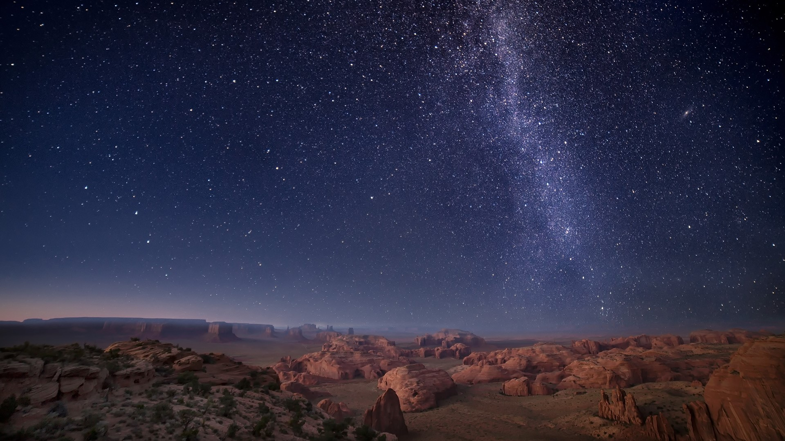
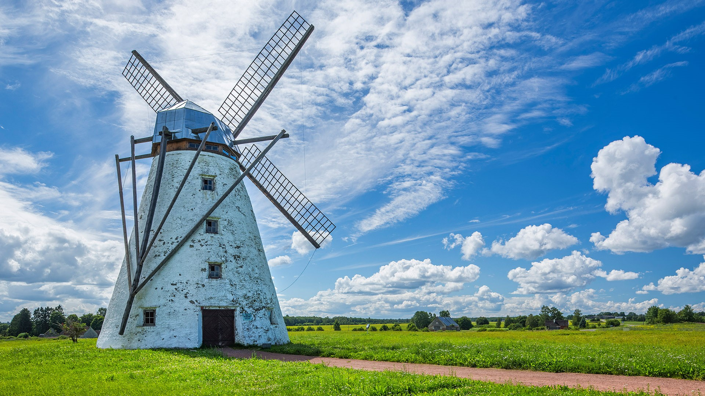
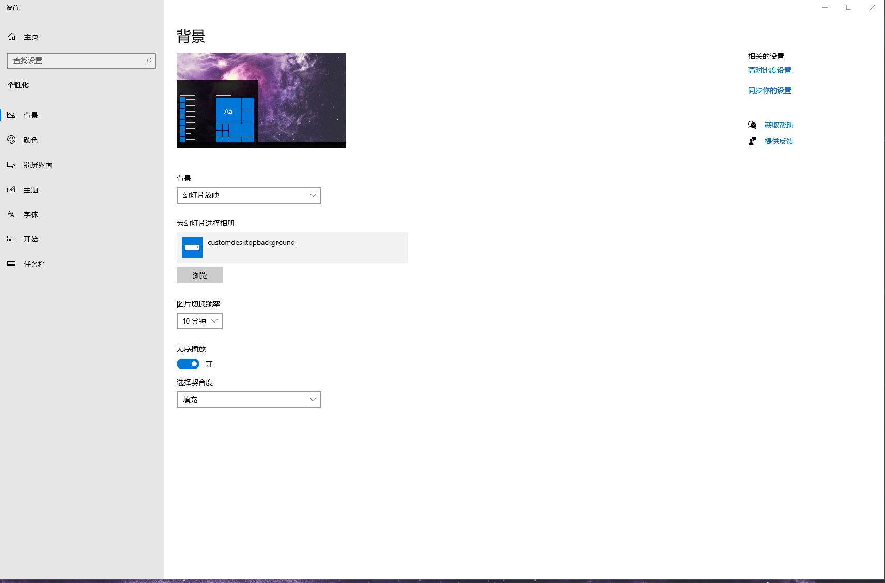
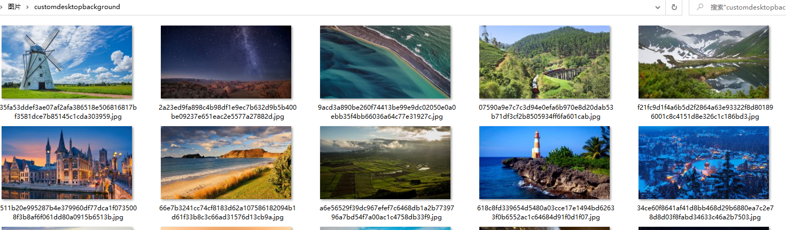

# 复制windows10锁屏界面变成主题

windows10锁屏界面图片都很好看，可以把它们变成windows10主题，进行幻灯片播放。

1. 先创建一个目录，代码里创建的是`用户目录\Pictures\customdesktopbackground`，然后在windows个性化背景里进行设置
   

2. 然后下载[get_windows_background.exe](https://github.com/burgleaf/get_windows_background/releases)这个文件并双击执行

3. 锁屏图片就自动copy到主题目录了并会随机播放。windows10应该是每周更新一次锁屏图片，这个文件可以一个星期执行一次
   